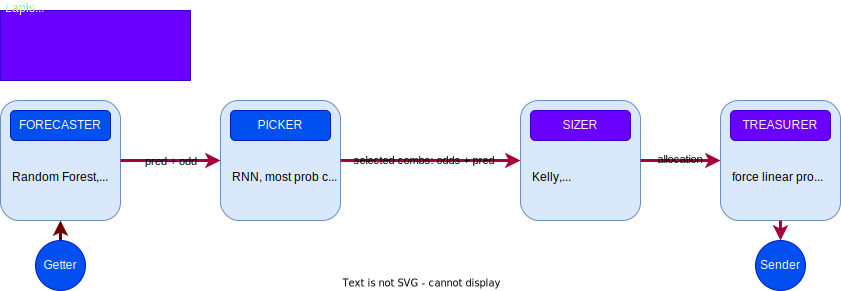

# Lapis 
Aim to build a solid pipeline to handle sports bets

## Scheme



Pipeline have been decomposed into 4 modules:

 - Forecaster: Predict outcomes probabilities
 - Picker: Selected match combinaisons
 - Sizer: Allocation on selected combinaisons
 - Treasurer: Define global amount according to global risk from combinaisons

The two last modules are linkers which deliver online/offline data (getter module) and act on fictive/real market (sender module)

## How to Install and Run the Project:
### From Docker:
```` docker compose up ````
### Run manually:
  1. Run redis docker image
  2. Open terminal for each module and run ```` poetry run python main.py ../model_config.yml ```` from module.

## Next contributions:
  - add .sh file to run backtesting and avoid manual running
  - add backtesting tools
  - run backtesting on batch


